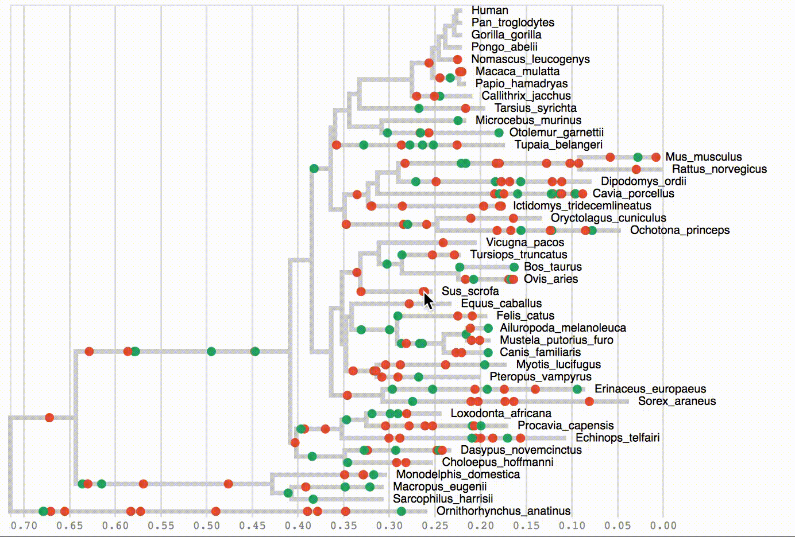

# PalantiR

`PalantiR` is a framework for phylogenetic simulation and visualization.

The framework focuses on Mutation-Selection codon models and temporal heterogeneity.

`PalantiR` is implemented as an `R` package, with a `C++` backend, and interactive `js` visualizations.

# Installation

## Downloading

`PalantiR` uses git submodules, and should be cloned with `--recursive` flag:

```
git clone --recursive https://github.com/dekoning-lab/PalantiR.git
```

## Dependencies

The dependencies for the `R` package can be istalled as follows:

```R
install.packages(c("RcppArmadillo", "htmlwidgets"))
```

## Building

If using `RStudio`, hit "Build & Reload".

Otherwise, navigate to one directory _above_ `PalantiR`, and run:

```bash
R CMD INSTALL --preclean --no-multiarch --with-keep.source PalantiR
```

In a new `R` session, run:

```R
library(PalantiR)
```

# Short demonstration

Below we show how to run a simulation with the Mutation-Selection model:

```R
# read phylogeny
p <- Phylogeny("data/mammals.newick")

# read amino acid fitness values
aa_psi <- read.csv("data/amino_acid_fitness_N_1000.csv")

# use first row
psi <- as.numeric(aa_psi[1,])

# make nucleotide substitution model
hky <- HasegawaKishinoYano(equilibrium = c(.25, .25, .25, .25))

# make codon substitution model
ms <- MutationSelection(
	population_size = 1000,
	mutation_rate = 1e-8,
	nucleotide_model = hky,
	fitness = psi)

# sample sequence from model equilibrium
s <- sample_sequence(model = ms, length = 100)

# simulate
sim <- simulate_over_phylogeny(phylogeny = p, model = ms, sequence = s)
```

We can view the resuling alignment:

```R
# examine alignment
plot(sim$alignment)

# save alignment as fasta
as.fasta(sim$alignment, "PalantiR_ms.fa")
```


We can also visualize the substitutions that have been simulated:

```R
# examine substitutions
plot(sim, sites = 1:10)

# check specific substitution data
head(sim$substitutions)
```


