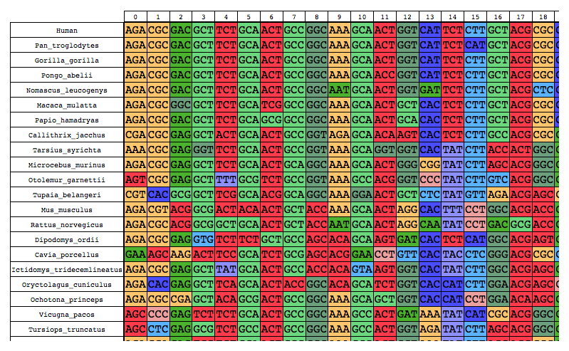

# PalantiR

`PalantiR` is a framework for phylogenetic simulation and visualization.

The framework focuses on Mutation-Selection codon models and temporal heterogeneity.

`PalantiR` is implemented as an `R` package, with a `C++` backend, and interactive `js` visualizations.

# Installation

## Downloading

`PalantiR` uses git submodules, and should be cloned with `--recursive` flag:

```
git clone --recursive https://github.com/dekoning-lab/PalantiR.git
```

## Dependencies

The dependencies for the `R` package can be istalled as follows:

```R
install.packages(c("RcppArmadillo", "htmlwidgets"))
```

# TL;DR

```R
# read phylogeny
p <- Phylogeny("data/mammals.newick")
# read amino acid fitness values
aa_psi <- read.csv("data/amino_acid_fitness_N_1000.csv")
# use first row
psi <- as.numeric(aa_psi[1,])
# make nucleotide substitution model
hky <- HasegawaKishinoYano(equilibrium = c(.25, .25, .25, .25))
# make codon substitution model
ms <- MutationSelection(population_size = 1000, mutation_rate = 1e-8, nucleotide_model = hky, fitness = psi)
# sample sequence from model equilibrium
s <- sample_sequence(model = ms, length = 100)
# simulate
sim <- simulate_over_phylogeny(phylogeny = p, model = ms, sequence = s)
```

We can view the resuling alignment:

```R
# examine alignment
plot(sim$alignment)
# save alignment as fasta
as.fasta(sim$alignment, "PalantiR_ms.fa")
```



We can also visualize the substitutions that have been simulated:

```R
# examine substitutions
plot(sim, sites = 1:10)
# check specific substitution data
head(sim$substitutions)
```


# Simulations in detail

The `Palantir` workflow revolves around a `SubstitutionModel` object.
There are several types of substitution models, detailed on the wiki pages.
An example of a simple `MutationSelection` model is provided here.

## Phylogeny

`PalantiR` simulates sequence evolution over a phylogeny.
We start by creating a new `Phylogeny` object.
The phylogenies are constructed by loading `.newick` format trees.
Several example trees are provided in `data/` directory.

```R
p <- Phylogeny("data/mammals.newick")
```

This phylogeny object can be printed for a quick inspection
