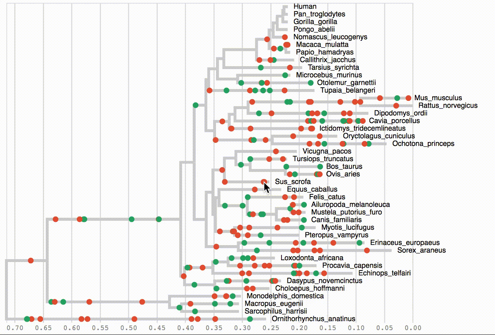

<p align="center">

</p>

# PalantiR

> :star: **Recently refreshed (August 2026):** version 1.2.0 contains
> correctness and validation fixes from a full source review, the
> [documentation site](https://dekoning-lab.github.io/PalantiR) has been
> rebuilt with reproducible examples, and the repository now includes
> [stand-alone command-line simulation scripts](examples/).

`PalantiR` is a framework for phylogenetic simulation and visualization,
implemented as an `R` package with a `C++` backend and interactive `js`
visualizations.

The package facilitates the simulation and visualization of complete
substitution histories, including every substitution event, with its time, 
codon states, and fitnesses - under time-heterogeneous mutation–selection codon
substitution models and other advanced models. Models support site-specific fitness
profiles, models with epistasis between sites ("mutation-selection-epistasis" codon
models), and changes in effective population size or fitness assignments along the
phylogeny.

See the documentation at
[dekoning-lab.github.io/PalantiR](https://dekoning-lab.github.io/PalantiR)

Substitution histories simulated under a mutation–selection model with
epistasis between site pairs; joint states of the interacting sites are shown
alongside the events on the tree:

<picture>
<source media="(prefers-color-scheme: dark)" srcset="docs/img/mutsel-epi.png">

</picture>

A fitness shift under a time-heterogeneous mutation–selection model; each dot
is a substitution (synonymous in green, non-synonymous in red), with the site's fitness
profile shown as a logo:

<picture>
<source media="(prefers-color-scheme: dark)" srcset="docs/img/fitness-shift.png">

</picture>

## Recent updates

Version 1.2.0 follows a full source review: 31 verified findings were fixed,
including corrected `CoEvolution` scaling and double-substitution semantics, a
proper GTR switching process for Markov-modulated models, input validation
throughout, reproducible simulations via `set_palantir_seed()`, and a
regression test suite. Some of these fixes change simulated output relative to
earlier versions; [NEWS.md](NEWS.md) lists them in full.

Version 1.1.0 corrects the transient rescaler used on branches where the model
changes (the forecast now advances at the site's rate multiplier) and adds an
opt-in exact alternative to it: `rescale_method = "exact"` replaces the branch
segmentation with a closed-form time change. The rescaler ensures the expected number
of substitutions per unit branch length are exact, and runs faster than the
segmented approach.

# Installation

The package can be installed automatically with `devtools`:

```R
devtools::install_github("dekoning-lab/PalantiR")
```

If you are installing from a local clone, use:
```R
devtools::install_local("path/to/palantir/clone")
```

*Note: `RcppArmadillo` is a required package. Compiling against it will require `gfortran`*

For MacOS, a copy of `gfortran` binaries can be downloaded from [CRAN tools](https://cran.r-project.org/bin/macosx/tools)

## Downloading

First, clone the `PalantiR` repo:

```bash
git clone https://github.com/dekoning-lab/PalantiR.git
```

## Dependencies

The dependencies for the `R` package can be installed as follows:

```R
install.packages(c("Rcpp", "RcppArmadillo", "jsonlite", "htmlwidgets", "Matrix", "lattice"))
```

## Building

If using `RStudio`, hit "Build & Reload".

Otherwise, navigate to one directory _above_ `PalantiR`, and run:

```bash
R CMD INSTALL --preclean --no-multiarch --with-keep.source PalantiR
```

In a new `R` session, run:

```R
library(PalantiR)
```

# Short demonstration

Below we show how to run a simulation with the Mutation-Selection model:

```R
# read phylogeny (from a clone, this file is inst/extdata/mammals.newick)
p <- Phylogeny(system.file("extdata", "mammals.newick", package = "PalantiR"))

# read amino acid fitness values
data(amino_acid_fitness_N_1000)
aa_psi <- amino_acid_fitness_N_1000

# use first row
psi <- as.numeric(aa_psi[1,])

# make nucleotide substitution model
hky <- HasegawaKishinoYano(equilibrium = c(.25, .25, .25, .25))

# make codon substitution model
ms <- MutationSelection(
	population_size = 1000,
	mutation_rate = 1e-8,
	nucleotide_model = hky,
	fitness = psi)

# sample sequence from model equilibrium
s <- sample_sequence(model = ms, length = 100)

# simulate
sim <- simulate_over_phylogeny(phylogeny = p, model = ms, sequence = s)
```

We can view the resulting alignment:

```R
# examine alignment
plot(sim$alignment)

# save alignment as fasta
as.fasta(sim$alignment, "PalantiR_ms.fa")
```


We can also visualize the substitutions that have been simulated:

```R
# examine substitutions (sites are 0-based, so the first ten are 0:9)
plot(sim, sites = 0:9)

# check specific substitution data
head(sim$substitutions)
```



# Command-line simulation

The [`examples/`](examples/) directory contains stand-alone scripts that run
`PalantiR` simulations from the shell, with arguments for the tree, population
sizes, number of sites, and random seed (run with `--help` for the full list):

```bash
# time-homogeneous mutation-selection with site-heterogeneous fitness profiles
Rscript examples/simulate_site_heterogeneous.R --sites=200 --population-size=10000

# time-heterogeneous: a larger population size on the primate clade
Rscript examples/simulate_time_heterogeneous.R --population-sizes=5000,30000
```

Each script writes codon and amino-acid `FASTA` alignments, the complete
substitution history, an interactive substitution-history plot, and a
`run_info.txt` recording parameters, seed, and package versions.
