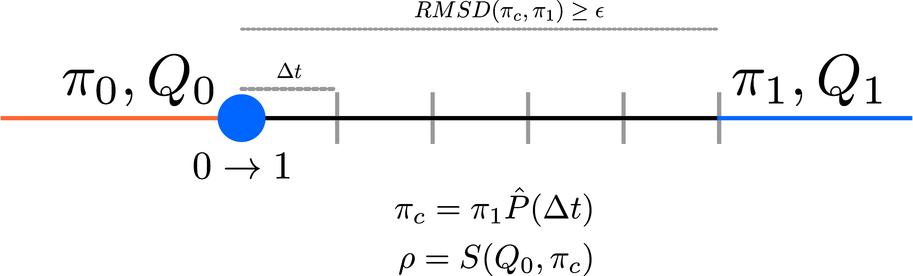

---
output:
  html_document:
    self_contained: no
---

```{r, include=F}
library(PalantiR)
library(knitr)
set_palantir_seed(20260820)
knitr::opts_chunk$set(fig.height = 7, fig.width = 9)
```

# Temporal Rate Rescaling

`PalantiR` uses a rescaling strategy to simulate smooth transitions in temporal heterogeneity simulations.
Temporal heterogeneity simulations have a "switch point" from one substitution model to another. This can correspond to a fitness shift or a population size change.

The idea is to continuously rescale the substitution rate matrix until the equilibrium distribution of the rescaled rates matrix matches that of the new matrix we switch into.

# Example



The figure shows a branch on which a switch occurs from substitution model `0` to to substitution model `1`.
Model `0` has a switching rates matrix `Q0` and an equilibrium distribution `π0`. The branch segment where model `0` applies is represented by an orange line.

The switch into model `1` is represented by a blue circle. The branch is now segmented into small sections of length `Δt`. We now calculate a rescaled version of `Q` and `π` for each of the branch segments.

## Rescaling

The idea is to calculate an empirical `π` for a short branch segment, given `Δt`.

For a small `t`, we can approximate transition probability `P` as `P ≈ Q⋅Δt + I`.

We then estimate the empirical `π` for the current branch segment as `π⋅P`.

Using the current estimate of `π`, we now want to calculate a scaling factor `ρ`, which will be used to rescale the current substitution rate matrix. The scaling function `S` is discussed in more detail in [Rate Matrix Scaling](Rate_Scaling.html).

The rescaled matrix `Q` is now used to simulate substitutions for the current branch segment.

The rescaling procedure is applied until the current `π` is within an acceptable range of the `π` for next model.
Once the `RMSD` between the two equilibrium vectors is within user-specified bound `ε`, the rescaling is stopped.
At this point, the simulation continues with substitution rate `Q1` and equilibrium distribution `π1`, corresponding to the model `1` (blue branch segment).


## The exact time change (v1.1.0)

Because every rescaled segment applies a scalar multiple of one rate matrix,
an out-of-equilibrium branch is exactly the homogeneous process run for an
adjusted intrinsic duration, and that duration can be computed in closed form
instead of segment by segment. Passing `rescale_method = "exact"` to
`simulate_over_interval_phylogeny` selects this method: it delivers the
branch's expected substitution budget exactly (the segment scheme delivers it
to within the segment discretisation), runs faster, and reports event times in
the same branch-position units, so output is interchangeable between the two
methods. The segment scheme remains the default.

Also note that since v1.0.1 the segment forecast advances at the site's rate
multiplier; earlier versions under-delivered substitutions on fast sites
during the transient.
