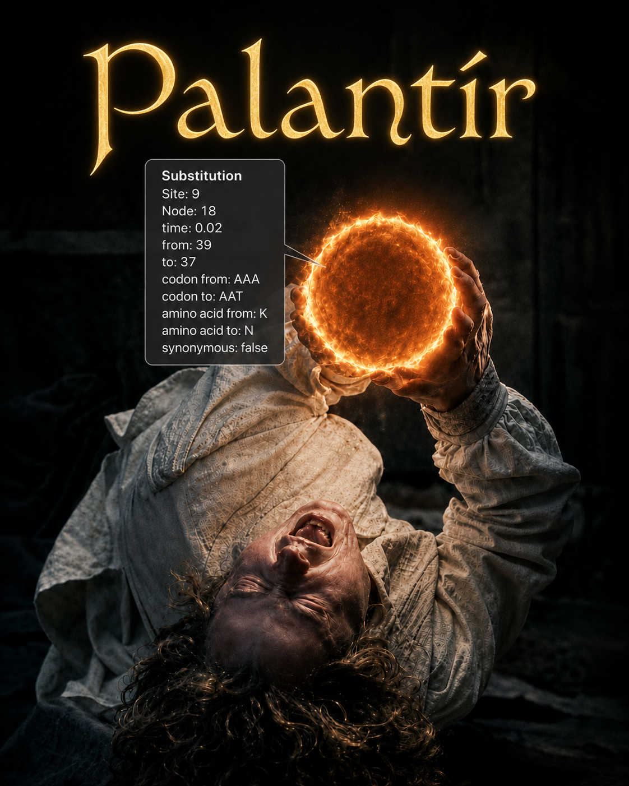
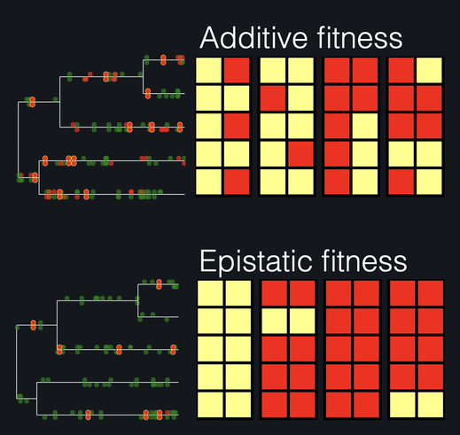
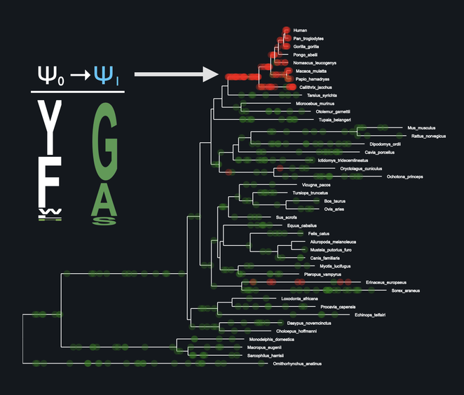

`PalantiR` simulates and visualizes complete substitution histories --- every
substitution event, with its time, codon, and fitness context --- under
time-heterogeneous mutation--selection codon substitution models and other
advanced models, including site-specific fitness profiles, epistasis between
sites, and changes in effective population size or fitness along a phylogeny.

For installation notes, see [this page](installation.html).

Details on particular models and simulation types can be found on the
following pages:

# Nucleotide Models

* [Hasegawa-Kishino-Yano](Hasegawa_Kishino_Yano.html)
* [General Time Reversible](General_Time_Reversible.html)

# Codon Models

* [Mutation-Selection](Mutation_Selection.html)
* [Co-evolution](Co_Evolution.html)
* [Markov-Modulated Mutation-Selection](Markov_Modulated_Mutation_Selection.html)

# Temporal Heterogeneity

* [Branch Heterogeneity](Branch_Heterogeneity.html)
* [Shared Model Substitution History](Shared_Substitution_History.html)
* [Shared Model Time History](Shared_Substitution_Times.html)

# Features

* [Rate Scaling](Rate_Scaling.html)
* [Temporal Heterogeneity Rescaling](Temporal_Heterogeneity_Rescaling.html)

# What's new in 1.2.0

Following a full source review: reproducible simulations via
`set_palantir_seed()`; an exact time-change alternative to the segment
rescaler (`rescale_method = "exact"`); corrected `CoEvolution` and
Markov-modulated model semantics; input validation throughout; and repaired
datasets and documentation. See
[NEWS.md](https://github.com/dekoning-lab/PalantiR/blob/master/NEWS.md) for
the complete list, including breaking changes.

<table style="border: none;"><tr style="background: none;">
<td style="border: none; text-align: center;">

<em>Substitution histories under mutation--selection with epistasis</em>
</td>
<td style="border: none; text-align: center;">

<em>A fitness shift under a time-heterogeneous mutation--selection model</em>
</td>
</tr></table>
